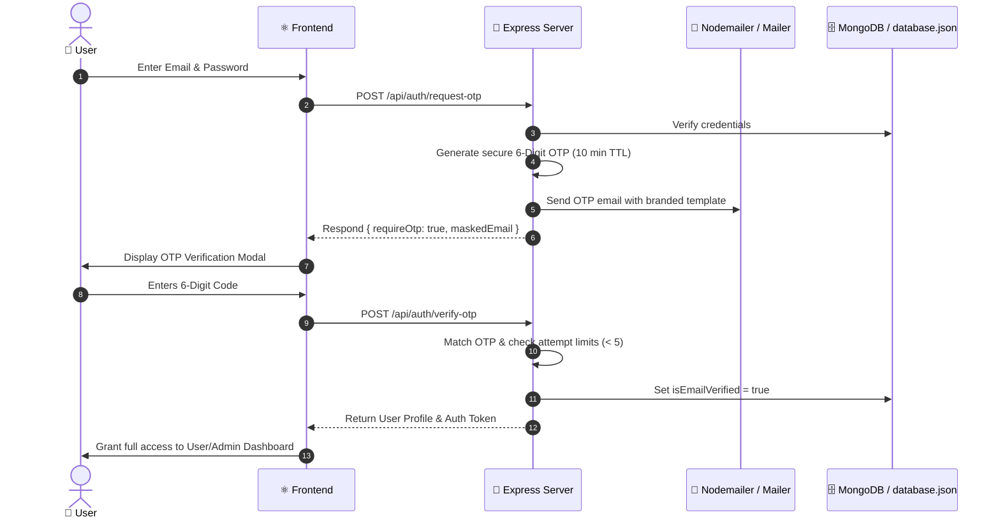

# 🌌 FAN HUB PLUS — Complete System Architecture & Project Flow Guide

> **Fan Hub Plus** ek modern, full-stack multi-fandom community discovery platform hai jo Anime, Gaming, Movies, TV Shows, K-Pop, Comics, Manga aur Cosplay ko ek interactive glassmorphic UI ke sath connect karta hai.

---

## 📑 Table of Contents
1. [Overview & Tech Stack](#-overview--tech-stack)
2. [High-Level System Architecture](#-high-level-system-architecture)
3. [End-to-End Data Flow (Kahan Se Kya Aata Hai?)](#-end-to-end-data-flow)
4. [Backend Architecture & API Endpoints (GET / POST / PATCH / DELETE)](#-backend-architecture--api-endpoints)
5. [Anime Subsystem (AniList, Jikan, Streaming, Details)](#-anime-subsystem-flow)
6. [Cosplay & Interactive Character Spotlight](#-cosplay--interactive-character-spotlight)
7. [Fan Submission & Moderation Lifecycle](#-fan-submission--moderation-lifecycle)
8. [Authentication, OTP Verification & Security Flow](#-authentication--security-flow)
9. [User Dashboard vs Admin Dashboard](#-dashboards-architecture)
10. [Database Architecture (Dual Storage: MongoDB + Persistent JSON)](#-database-architecture)
11. [AI Intelligence (Gemini 2.5 Flash & Fallback)](#-ai-intelligence-flow)
12. [Folder Structure & Key File Map](#-folder-structure--key-file-map)
13. [How to Run & Configure](#-how-to-run--configure)

---

## 🚀 Overview & Tech Stack

| Layer | Technologies Used | Purpose |
| :--- | :--- | :--- |
| **Frontend Framework** | React 19 + TypeScript + Vite 8 | Ultra-fast SPA with reactive UI components |
| **Styling & Effects** | Tailwind CSS v4 + Framer Motion + Lucide Icons | Neon cyan glow, dark/light glassmorphism, smooth animations |
| **Routing & State** | React Router v7 + Context API + Custom Stores | Single-page client navigation & synchronized state |
| **Backend Server** | Node.js + Express + TSX | REST API proxy, Auth OTP dispatch, CRUD endpoints |
| **Databases** | MongoDB (Mongoose) + Persistent `database.json` | Dual-mode storage (cloud DB with zero-fail offline fallback) |
| **External APIs** | AniList (GraphQL), Jikan (REST v4), Google Gemini AI | Realtime anime metadata, search, streaming trailers & AI chat |
| **Mailing / Email** | Nodemailer (SMTP) | Automated 6-digit OTP verification & Password resets |
| **Audio API** | Web Audio API (Synthesizer Oscillators) | Sound FX on cosplay switches & power surge triggers |

---

## 🏗️ High-Level System Architecture

```mermaid
flowchart TD
    User([👤 User / Visitor / Admin]) -->|Browser UI| Frontend[⚛️ React 19 Frontend SPA]

    subgraph Frontend_Layer ["Client Side (React / Vite)"]
        Frontend --> Router[React Router v7]
        Router --> Pages[Pages: Home, Anime, Explore, Cosplay, Merch, Dashboards]
        Pages --> Contexts[AuthContext, AppContext, ThemeContext]
        Pages --> Stores[ContentStore & LocalStorage Cache]
        Pages --> CustomHooks[useAnime, useAnimeNews, useExternalMedia]
    end

    Frontend_Layer -->|HTTP REST & Proxies| Backend[🚀 Express Backend Server (Port 3000)]

    subgraph Backend_Layer ["Server Side (Node / Express)"]
        Backend --> AuthController[Auth & OTP Handler + Nodemailer]
        Backend --> SubmissionsController[Submission & Moderation Engine]
        Backend --> UploadController[Media Upload Handler /public/uploads]
        Backend --> AIController[Gemini 2.5 Flash AI Chat]
        Backend --> Proxies[AniList GraphQL & Jikan REST Proxies]
    end

    subgraph Storage_Layer ["Data Storage (Dual Sync Engine)"]
        Backend --> Mongo[(🍃 MongoDB Atlas Cloud)]
        Backend --> JSONFile[(📄 data/database.json Fallback)]
    end

    subgraph External_APIs ["External Data Providers"]
        Proxies --> AniListAPI[🌐 AniList GraphQL API]
        Proxies --> JikanAPI[🌐 Jikan Anime API v4]
        AIController --> GoogleGenAI[🤖 Google Gemini AI Studio]
        AuthController --> SMTPServer[📧 SMTP Mail Server]
    end
```

---

## 🔄 End-to-End Data Flow

### 1. Anime Data Flow (AniList + Jikan)
1. **Request**: Jab user Home page, Trending, ya `/anime/:id` open karta hai.
2. **Hook Trigger**: `useAnime()` hook ya `anilist.ts` service trigger hoti hai.
3. **Internal Proxy**: Request `POST /api/proxy/anilist` ya `GET /api/proxy/jikan/*` par jati hai (CORS aur Rate-limiting se bachne ke liye).
4. **Transform**: Raw response `animeMapper.ts` me sanitize hota hai aur frontend cards me display hota hai.
5. **Cache**: Client-side `animeCache.ts` and `localStorage` me response cache hota hai taake fast loading ho.

### 2. Fan Upload / Submission Flow
1. **User Submission**: User `/submit` page par title, category, description, aur photo/video select karta hai.
2. **File Upload**: Agar image/video hai toh pehle `POST /api/upload` par Base64 format me jati hai aur server ke `/public/uploads/` folder me save ho kar static URL ban jati hai.
3. **Queue Save**: Data `POST /api/submissions` par bheja jata hai jahan status `"pending"` set hota hai.
4. **Admin Approval**: Admin `/admin` dashboard me jakar "Approve" button press karta hai (`PATCH /api/submissions/:id/status` with `status: "approved"`).
5. **Auto Explore Sync**: Approve hotey hi backend automatically submission ko `/api/explore` catalog me inject kar deta hai jisse yeh tamam users ko `/explore` page par live nazar aane lagta hai!

---

## 📡 Backend Architecture & API Endpoints

### 🔐 Authentication & Session Endpoints
| Method | Route | Description | Request Body / Query |
| :--- | :--- | :--- | :--- |
| `POST` | `/api/auth/request-otp` | Email & password verify kar ke 6-digit OTP email par send karta hai | `{ email, password }` |
| `POST` | `/api/auth/verify-otp` | 6-digit OTP verify karta hai aur user session login karta hai | `{ email, otp }` |
| `POST` | `/api/auth/resend-otp` | Fresh 6-digit OTP regenerate kar ke email bhejta hai | `{ email }` |
| `POST` | `/api/auth/signup` | Naya user account create karta hai aur initial store setup karta hai | `{ name, email, password, favorite }` |
| `GET` | `/api/auth/me` | Logged-in user ka profile data fetch karta hai | `?userId=usr-...` |
| `GET` | `/api/auth/verify-admin` | Check karta hai ke current session Admin role ka hai ya nahi | `?userId=admin-1` |
| `PUT` | `/api/auth/profile` | User ka name, avatar, aur favorite categories update karta hai | `{ userId, name, avatar, favorites }` |
| `POST` | `/api/auth/forgot-password/request` | Password reset ke liye 6-digit OTP code bhejta hai | `{ email }` |
| `POST` | `/api/auth/forgot-password/confirm` | Reset OTP verify kar ke naya password save karta hai | `{ email, otp, newPassword }` |

---

### 👤 User Interactivity & Watchlist Endpoints
| Method | Route | Description |
| :--- | :--- | :--- |
| `GET` | `/api/users/:userId/data` | User ka watchlist, favorites, ratings, aur activity logs fetch karta hai |
| `POST` | `/api/users/:userId/watchlist` | Content item ko watchlist me add/remove (toggle) karta hai |
| `POST` | `/api/users/:userId/favorites` | Fandom category ko favorite list me toggle karta hai |
| `POST` | `/api/users/:userId/ratings` | Content ko user score rating assign karta hai (e.g., 9.5/10) |
| `POST` | `/api/users/:userId/activities` | Nayi user activity log karta hai (e.g., viewed anime, added bookmark) |

---

### 📝 Submissions, Explore & Merchandise Endpoints
| Method | Route | Description |
| :--- | :--- | :--- |
| `GET` | `/api/submissions` | Tamam fan submissions fetch karta hai (Admin view & Status check) |
| `POST` | `/api/submissions` | Fan lore article ya character profile submit karta hai (`pending`) |
| `PATCH` | `/api/submissions/:id/status` | Admin status change: `"approved"` ya `"rejected"`. Approved items Explore me publish ho jate hain |
| `DELETE` | `/api/submissions/:id` | Submission delete karta hai aur Explore se bhi remove karta hai |
| `GET` | `/api/explore` | Public explore items fetch karta hai (Curated + Approved submissions) |
| `POST` | `/api/explore` | Direct explore item add ya update karta hai (Admin) |
| `DELETE` | `/api/explore/:id` | Explore catalog item delete karta hai |
| `GET` | `/api/merchandise` | Official & fan merchandise items list fetch karta hai |
| `POST` | `/api/merchandise` | Merchandise item add ya edit karta hai |
| `DELETE` | `/api/merchandise/:id` | Merchandise item remove karta hai |

---

### 🤖 AI, Uploads & Proxy Endpoints
| Method | Route | Description |
| :--- | :--- | :--- |
| `POST` | `/api/upload` | Base64 media (JPG, PNG, WEBP, MP4, WEBM) ko `/public/uploads/` me save karta hai |
| `POST` | `/api/gemini/chat` | Google Gemini 2.5 Flash AI chatbot response generate karta hai |
| `POST` | `/api/proxy/anilist` | AniList GraphQL query proxy (bypass CORS, safe caching) |
| `GET` | `/api/proxy/jikan/*` | Jikan REST Anime API v4 proxy |
| `GET` | `/api/proxy/external` | External RSS feeds aur news articles fetch karta hai |
| `GET` | `/api/db-status` | Current database mode (MongoDB vs JSON fallback) aur metrics return karta hai |
| `POST` | `/api/db-connect` | Live MongoDB connection string connect karta hai |

---

## 📺 Anime Subsystem Flow

```
[User Browses Anime] 
       │
       ├──> Top Airing / Trending  ──> anilist.ts (GraphQL Query) ──> /api/proxy/anilist ──> AniList Server
       ├──> Search & Filter        ──> api.ts (Jikan Search)     ──> /api/proxy/jikan/*  ──> Jikan API v4
       ├──> Anime Details & Cast   ──> AnimeDetail.tsx           ──> Jikan Anime Characters & Trailers
       └──> News & Updates         ──> useAnimeNews.ts           ──> /api/proxy/external ──> RSS Feeds
```

- **Trailer Streaming**: Anime detail page par YouTube video embed or direct MP4 trailer display hota hai.
- **Voice Actors & Characters**: Anime ke primary voice actors, Japanese kanji names, aur role details dynamic display hoti hain.
- **Watchlist & Rating**: Instant 1-click bookmarking system jo user dashboard se sync rehta hai.

---

## 🎭 Cosplay & Interactive Character Spotlight

Cosplay section (`/explore/cosplay` aur `CosplaySpotlight.tsx`) 12 high-tier anime character profiles ko visual & audio effects ke sath present karta hai:

- **Characters Included**:
  1. **Satoru Gojo** (Jujutsu Kaisen) — `#60a5fa`
  2. **Son Goku** (Dragon Ball) — `#f97316`
  3. **Monkey D. Luffy** (One Piece) — `#ef4444`
  4. **Naruto Uzumaki** (Naruto) — `#f59e0b`
  5. **Ryomen Sukuna** (Jujutsu Kaisen) — `#dc2626`
  6. **Itachi Uchiha** (Naruto) — `#b91c1c`
  7. **Levi Ackerman** (Attack on Titan) — `#10b981`
  8. **Eren Yeager** (Attack on Titan) — `#84cc16`
  9. **Tanjiro Kamado** (Demon Slayer) — `#06b6d4`
  10. **Killua Zoldyck** (Hunter x Hunter) — `#8b5cf6`
  11. **Roronoa Zoro** (One Piece) — `#10b981`
  12. **Vegeta** (Dragon Ball) — `#3b82f6`

- **Interactive Combat Ratings**: Power, Speed, Durability, Intelligence, Combat IQ meters.
- **Web Audio API**:
  - `playSwitchSound()`: High-tech frequency oscillator bip on card switch.
  - `playPowerSurgeSound()`: Low-frequency power hum on favorite/watchlist action.
- **Filters**: Categories (*Dragon Ball, Naruto, One Piece, Jujutsu Kaisen, Attack on Titan, Demon Slayer, Hunter x Hunter*).

---

## 🛡️ Authentication & Security Flow



---

## 📊 Dashboards Architecture

### 1. 👤 User Dashboard (`/dashboard`)
- **My Watchlist**: Saved anime series, movies, and figures.
- **My Ratings**: User-submitted ratings and reviews.
- **My Submissions**: Real-time status badges (`Pending Approval`, `Approved & Published`, `Rejected`).
- **Profile Customizer**: Change display name, select avatar seed, customize fandom interests.
- **Activity Stream**: Live timestamped timeline of user actions.

### 2. 👑 Admin Command Center (`/admin`)
- **Submission Queue & Live Moderation**: Live preview modal of submitted articles/videos with 1-click `Approve` or `Reject`.
- **User Management**: View all users, toggle verified badges, check registration dates and roles.
- **Explore Manager**: Add, edit, or delete items from the global explore catalog.
- **Merchandise Manager**: Add new figures, prices, tags, and stock status.
- **Database Engine Monitor**: Live status of MongoDB connection, document count, and live URI reconnection.
- **FAQ Management**: Dynamic FAQ editor for user support.

---

## 🗄️ Database Architecture (Dual Storage Engine)

Fan Hub Plus **Zero-Failure Architecture** use karta hai:

```
                  ┌──────────────────────────────┐
                  │      Express API Router      │
                  └──────────────┬───────────────┘
                                 │
                 ┌───────────────┴───────────────┐
                 ▼                               ▼
    ┌──────────────────────────┐    ┌──────────────────────────┐
    │  🍃 MongoDB Atlas Cloud   │    │  📄 Persistent JSON DB    │
    │  (Primary Storage)       │    │  (data/database.json)    │
    │  • Users & UserData      │    │  • Instant Local Sync    │
    │  • Submissions           │    │  • Zero-Crash Fallback   │
    │  • Explore & Merch       │    │  • Standalone Ready      │
    │  • FAQs & Feedback       │    │                          │
    └──────────────────────────┘    └──────────────────────────┘
```

1. **MongoDB Connection**: Agar `.env` me `MONGODB_URI` set hai, toh application automatically MongoDB ke sath connect ho kar sari collections sync karti hai.
2. **JSON Fallback**: Agar internet down ho ya MongoDB available na ho, toh server bina ruke `data/database.json` se 100% features run karta hai.

---

## 🤖 AI Intelligence Flow

1. **Endpoint**: `POST /api/gemini/chat`
2. **Primary Engine**: `@google/genai` library with `gemini-2.5-flash` model.
3. **Multi-Model Fallback Chain**:
   - `gemini-2.5-flash`
   - `gemini-1.5-flash-latest`
   - `gemini-2.0-flash`
   - `gemini-1.5-flash`
4. **Offline Mode**: Agar API key missing ho, toh pre-built smart responses return hote hain jo Anime, Movies, Games, aur Merch ke baray me guides provide karte hain.

---

## 📁 Folder Structure & Key File Map

```
fan-hub-plus/
├── data/
│   └── database.json            # Local persistent JSON database
├── public/
│   └── uploads/                 # Stored user media files (Images, Videos)
├── server/
│   ├── email.ts                 # Nodemailer OTP email dispatch service
│   └── mongodb.ts               # Mongoose models & database manager
├── src/
│   ├── components/
│   │   ├── cosplay/
│   │   │   └── CosplaySpotlight.tsx # Interactive Cosplay hero & sound FX
│   │   ├── layout/
│   │   │   ├── Navbar.tsx       # Header with Search, Theme toggle, Auth modal
│   │   │   ├── Footer.tsx       # Glassmorphic footer & social links
│   │   │   └── MobileNav.tsx    # Mobile responsive navigation bar
│   │   └── ui/                  # Reusable badges, buttons, cards, modals
│   ├── context/
│   │   ├── AuthContext.tsx      # User session, login, OTP state
│   │   ├── AppContext.tsx       # Global toast alerts & notifications
│   │   └── ThemeContext.tsx     # Dark / Light glassmorphic theme state
│   ├── data/
│   │   ├── cosplayCharacters.ts # 12 Cosplay character profiles & Web Audio
│   │   └── events.ts            # Community events & conventions
│   ├── hooks/
│   │   ├── useAnime.ts          # Anime API query & caching hook
│   │   ├── useAnimeNews.ts      # Live industry news scraper hook
│   │   └── useExternalMedia.ts  # TMDB/Trakt media loader
│   ├── pages/
│   │   ├── Home.tsx             # Hero showcase & trending media
│   │   ├── Explore.tsx          # Multi-fandom catalog & Cosplay tab
│   │   ├── AnimeDetail.tsx      # Episodes, voice actors, streaming player
│   │   ├── Characters.tsx       # Character directory & role explorer
│   │   ├── CharacterDetail.tsx  # Character lore, voice actors, stats
│   │   ├── SubmitContent.tsx    # Fan upload portal
│   │   ├── Dashboard.tsx        # User profile, watchlist, activities
│   │   ├── AdminDashboard.tsx   # Moderation queue, DB manager, users
│   │   ├── Merchandise.tsx      # Figure & apparel showcase
│   │   ├── Events.tsx           # Community conventions & watch parties
│   │   └── ProjectFlow.tsx      # Interactive visual platform workflow
│   ├── services/
│   │   ├── anilist.ts           # AniList GraphQL queries
│   │   ├── api.ts               # Jikan REST Anime API client
│   │   ├── external.ts          # External news & trailer helpers
│   │   └── gemini.ts            # Gemini AI client helpers
│   ├── utils/
│   │   ├── contentStore.ts      # Client content cache & submission sync
│   │   └── animeCache.ts        # Local storage anime cache
│   ├── App.tsx                  # Main router & page routes
│   └── main.tsx                 # React entrypoint
├── .env                         # Server environment variables (API keys, DB, SMTP)
├── package.json                 # Dependencies & project scripts
├── server.ts                    # Full Express backend REST API server
├── server-dev.ts                # Vite development server runner
└── vite.config.ts               # Vite bundler configuration
```

---

## ⚙️ How to Run & Configure

### 1. Install Dependencies
```bash
npm install
```

### 2. Configure Environment Variables (`.env`)
Create or edit `.env` in the root folder:
```env
PORT=3000

# Gemini AI (Optional - get from aistudio.google.com)
GEMINI_API_KEY=your_gemini_api_key_here

# MongoDB Database (Optional - defaults to persistent database.json)
MONGODB_URI=mongodb+srv://<username>:<password>@cluster.mongodb.net/fanhub

# Email SMTP for Real OTPs (Optional - defaults to dev console OTP)
SMTP_HOST=smtp.gmail.com
SMTP_PORT=586
SMTP_USER=your_email@gmail.com
SMTP_PASS=your_email_app_password
SMTP_FROM="Fan Hub Plus <no-reply@fanhub.plus>"
```

### 3. Start Development Server
```bash
npm run dev
```
Open **`http://localhost:3000`** in your browser.

### 4. Build for Production
```bash
npm run build
npm run start
```

---

## 🎯 Summary
Fan Hub Plus ek unified ecosystem hai jisme:
- **Frontend** responsive React 19 SPA ke zariye dynamic content dikhata hai.
- **Backend** Express server secure OTP authentication, proxy APIs, media uploads, aur live database sync provide karta hai.
- **Anime & Cosplay** modules AniList, Jikan, aur custom Web Audio API ke sath real-time multimedia experience deliver karte hain.
